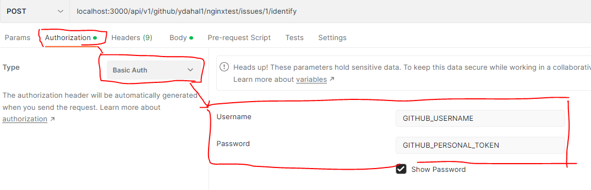

#### Installation Guide

```
1. Clone repo
2. Install dependencies in the root
3. Default port for app is 3000, if default port is not available follow step 4
4. Create.env file in root use .env.sample as template and update port variable
5. To spin the app - run nodemon server.js
6. To run tests follow steps 7 and 8
7. Create .env.test.js file inside .tests directory. Use sample.env.test for sample.
8. Update your Github username and token and run npm test to start test
```

#### Note

> All routes except "/health" are protected by BasicAuth. Provide your Github username and personal token to access protected routes.



#### Test end points

```
HAPPY PATHS
1. Health Check - localhost:3000/health
2. Get Issue info - localhost:3000/api/v1/github/ydahal1/nginxtest/issue/1
3. Add comment  - localhost:3000/api/v1/github/ydahal1/nginxtest/issues/1/comment
                  {"body" : "Comment posted from github comment scanner app"}
4. Identify if issue has image and comment - localhost:3000/api/v1/github/ydahal1/nginxtest/issues/3/identify
                  {"body" : "I found an image in your issue at {date} {time}"}
```

```
UNHAPPY PATHS
1. Health Check - localhost:3000/healthcheck [ 404 -  not found ]
2. Get Issue info - localhost:3000/api/v1/github/ydahal1/nginxtest/issue/one [ 403 - Invalid issue number]
3. Add comment  - localhost:3000/api/v1/github/ydahal1/nginxtest/issues/1/comment
                body : {} [ 403 - Invalid comment ]
4. Request to any endpoints other then '/health' without personal token and username [ 401 - Unauthorized ]
```
